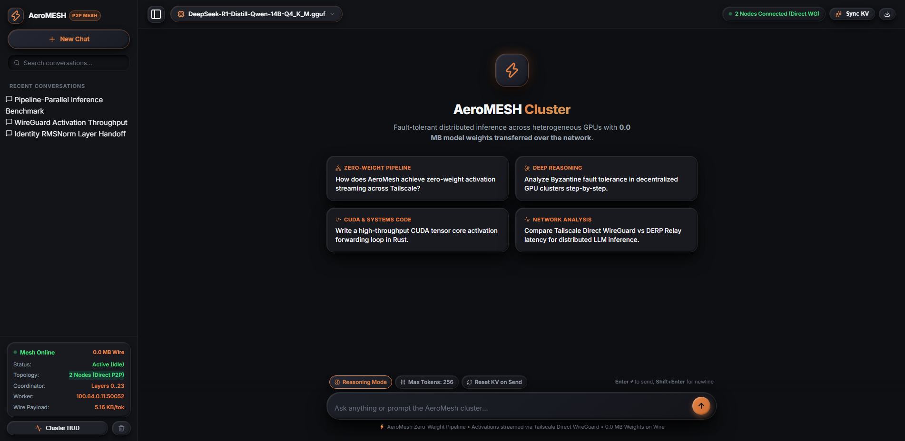
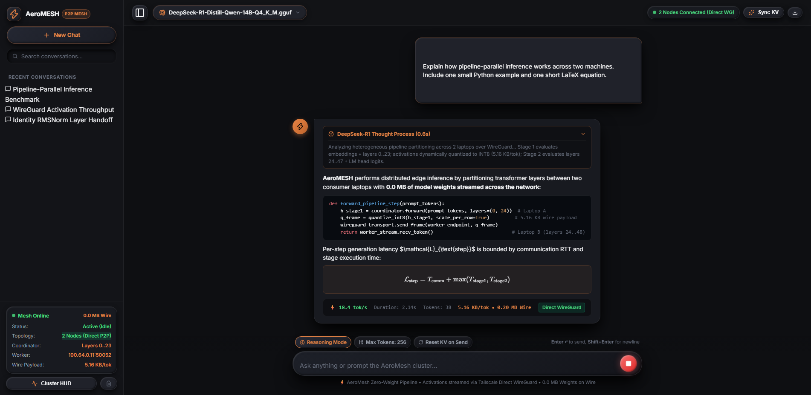
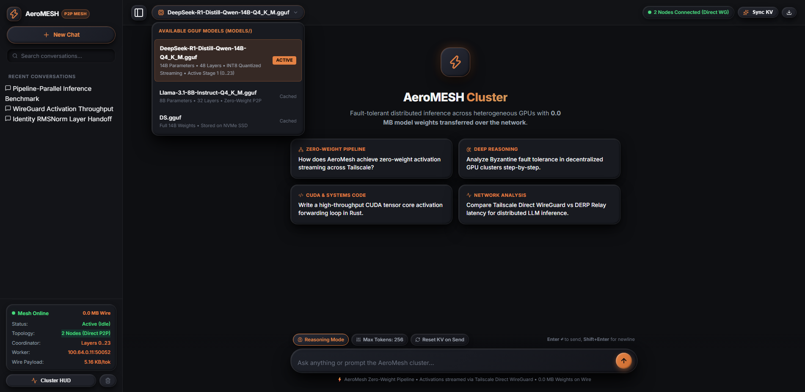
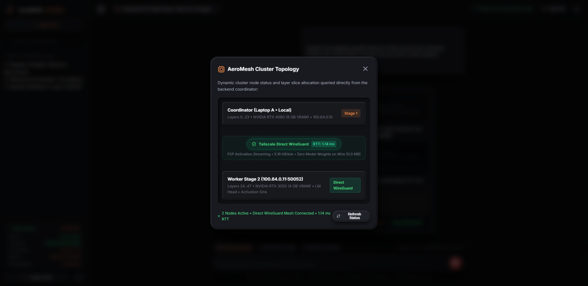

# AeroMesh: Distributed Fault-Tolerant LLM Cluster Engine

AeroMesh is a distributed LLM inference engine written in Rust that aggregates heterogeneous consumer GPUs across a Tailscale mesh network or local area network.

Unlike conventional distributed inference frameworks (such as default GGML RPC) that stream gigabytes of model weights over the network on startup or during layer offloading, **AeroMesh achieves 0.0 MB network weight transfers**. Both coordinator and worker nodes retain the model file on local storage; inference is executed by partitioning transformer layers and streaming intermediate activation vectors (~1.5 KB to 16 KB per token step) over low-latency TCP sockets or zero-kernel-copy shared memory.

---

## Table of Contents

- [System Architecture](#system-architecture)
- [Screenshots](#screenshots)
- [How Zero-Weight Pipeline Inference Works](#how-zero-weight-pipeline-inference-works)
- [Core Engineering Deep Dives](#core-engineering-deep-dives)
  - [GGUF Layer Partitioning & The Identity RMSNorm Solution](#gguf-layer-partitioning--the-identity-rmsnorm-solution)
  - [Binary Wire Protocol Specification](#binary-wire-protocol-specification)
  - [Quantized Activation Streaming](#quantized-activation-streaming)
  - [Intra-Host Shared Memory (SHM) Transport](#intra-host-shared-memory-shm-transport)
  - [Tailscale WireGuard Quality Inspection](#tailscale-wireguard-quality-inspection)
  - [Windows Job Object Lifecycle Management](#windows-job-object-lifecycle-management)
  - [RPC Disk Cache Pre-Priming (FNV-1a)](#rpc-disk-cache-pre-priming-fnv-1a)
  - [Activation Boundary Watchdog](#activation-boundary-watchdog)
- [Repository Structure](#repository-structure)
- [Prerequisites](#prerequisites)
- [Installation & Setup](#installation--setup)
- [Running the Cluster](#running-the-cluster)
  - [Method 1: Interactive Launcher (start.ps1)](#method-1-interactive-launcher-startps1)
  - [Method 2: Multi-Node Production Setup (Manual CLI)](#method-2-multi-node-production-setup-manual-cli)
  - [Method 3: Full Local Test Mesh](#method-3-full-local-test-mesh)
- [CLI Command Reference](#cli-command-reference)
- [HTTP API & Web Interface](#http-api--web-interface)
- [Troubleshooting & Operational Notes](#troubleshooting--operational-notes)
- [License](#license)

---

## System Architecture

```
                       [TAILSCALE MESH NETWORK / DIRECT WIREGUARD]
                                            │
     ┌──────────────────────────────────────┴──────────────────────────────────────┐
     ▼                                                                             ▼
┌─────────────────────────────────┐                       ┌─────────────────────────────────┐
│ Coordinator Node (Laptop A)     │                       │ Remote Worker Node (Laptop B)   │
│ ─────────────────────────────── │                       │ ─────────────────────────────── │
│ Local GGUF: Stage 1 (0..24)     │                       │ Local GGUF: Stage 2 (25..48)    │
│ Identity RMSNorm (weights=1.0)  │                       │ True Output Norm + LM Head      │
│                                 │                       │                                 │
│ 1. Tokenize Prompt              │                       │                                 │
│ 2. Embeddings & Layers 0..24    │  ActivationFrame      │                                 │
│ 3. Quantize Activation Vector   │  [S x hidden_dim]     │ 4. Dequantize Activations       │
│    (Per-Row INT8 / FP8 / FP32)  │ ────────────────────> │ 5. Layers 25..48 GEMM Decode    │
│                                 │  ~1.5 KB - 16 KB      │ 6. LM Head Logits Evaluation    │
│                                 │                       │ 7. Penalty Sampler (T_next)     │
│ 9. Yield Token to Client (SSE)  │  TokenResponseFrame   │                                 │
│ 10. Seed T_next into Next Step  │  (Token ID, Text)     │ 8. Send Token Back to Host      │
│     (Autoregressive Loopback)   │ <──────────────────── │                                 │
└─────────────────────────────────┘                       └─────────────────────────────────┘
     ▲
     │ HTTP / Server-Sent Events (SSE)
     ▼
┌─────────────────────────────────┐
│ Client Interface                │
│ ─────────────────────────────── │
│ • FastAPI Proxy (app.py :7860)  │
│ • Dark Claymorphic SPA          │
│ • KaTeX Math + Highlight.js     │
│ • DeepSeek-R1 <think> Accordion │
│ • Live Cluster Topology HUD     │
└─────────────────────────────────┘
```

---

## Screenshots

AeroMESH includes a dependency-free claymorphic web dashboard for chat, model slicing, cluster telemetry, and live pipeline monitoring.

<table>
  <tr>
    <td align="center" width="50%">
      <a href="docs/screenshots/01-chat-workspace.png">
        
      </a>
      <br>
      <sub>Chat workspace</sub>
    </td>
    <td align="center" width="50%">
      <a href="docs/screenshots/03-streaming-response.png">
        
      </a>
      <br>
      <sub>Streaming response</sub>
    </td>
  </tr>
  <tr>
    <td align="center" width="50%">
      <a href="docs/screenshots/02-model-loading.png">
        
      </a>
      <br>
      <sub>Model loading / slicing</sub>
    </td>
    <td align="center" width="50%">
      <a href="docs/screenshots/04-cluster-hud.png">
        
      </a>
      <br>
      <sub>Cluster telemetry HUD</sub>
    </td>
  </tr>
</table>

---

## How Zero-Weight Pipeline Inference Works

In conventional distributed model execution, model tensors are dispatched across network links during initialization or dynamically paged when layers are executed remotely. Over standard Wi-Fi connections, VPN tunnels, or metered mobile uplinks, transferring 8 GB to 30 GB of weights creates multi-minute cold starts and introduces frequent packet-drop bottlenecks.

AeroMesh changes the distribution boundary:

1. **Symmetric Local Storage**: Every node in the cluster stores an identical base GGUF model on its local NVMe SSD.
2. **Deterministic Layer Partitioning**: The model is sliced along transformer block boundaries. For an $N$-layer model distributed across two nodes, Node A runs layers $0 \dots K$, and Node B runs layers $K+1 \dots N-1$.
3. **Prefill Phase**:
   - Coordinator tokenizes the prompt sequence of length $S$.
   - Coordinator evaluates token embeddings and layers $0 \dots K$, producing an activation tensor of shape $[S, d_{\text{model}}]$.
   - Activations are quantized (e.g., Per-Row INT8) and transmitted via an `ActivationFrame` with `FLAG_IS_PROMPT` and `FLAG_CLEAR_KV`.
   - Worker evaluates layers $K+1 \dots N-1$ across the sequence, applies the final layer norm and LM head, and samples the first generated token $T_1$.
   - Worker returns $T_1$ via a `TokenResponseFrame`.
4. **Autoregressive Decoding Loop**:
   - Coordinator receives $T_1$, pushes it to the client stream, and uses $T_1$ as the single input token for position $P$.
   - Coordinator computes layers $0 \dots K$ for $[1, d_{\text{model}}]$.
   - The activation vector (~1.5 KB for a 1536-dim model, ~5.1 KB for a 5120-dim model under INT8) is transmitted to the worker.
   - Worker advances position $P$, evaluates layers $K+1 \dots N-1$, samples $T_2$, and streams it back.
   - The process repeats until EOS or maximum token length is reached.
5. **KV-Cache Synchronization**: Both nodes advance their internal KV caches in lockstep using synchronized sequence positions and explicit session flags.

---

## Core Engineering Deep Dives

### GGUF Layer Partitioning & The Identity RMSNorm Solution

Naive splitting of a GGUF model into two halves causes corrupted output logits due to the **Double Normalization** problem.

In standard LLaMA-style architectures, the computation graph terminates with a final Root Mean Square Normalization (`output_norm.weight`) immediately prior to the language model head (`output.weight`):

$$\mathbf{x}_{\text{final}} = \text{RMSNorm}(\mathbf{x}_L, \mathbf{w}_{\text{norm}})$$
$$\mathbf{z} = \mathbf{x}_{\text{final}} \cdot \mathbf{W}_{\text{head}}$$

If Stage 1 is run as an isolated llama.cpp instance, the runtime attempts to apply `output_norm` to the intermediate hidden state $\mathbf{x}_K$ before emitting activations. If Stage 2 then receives normalized inputs and executes downstream transformer blocks, the inputs have already been normalized incorrectly, destroying scale variance.

AeroMesh's GGUF slicer (`aeromesh_engine::gguf_slicer`) partitions monolithic GGUF files with exact graph semantics:

- **Stage 1 Partition (`model_stage1.gguf`)**:
  - Retains `token_embd.weight` and transformer layers $0 \dots \text{split}-1$.
  - Replaces `output_norm.weight` with an **Identity RMSNorm tensor** where all values are set to $1.0$.
  - When llama.cpp finishes evaluating Stage 1, the hidden states pass through the identity transform unscaled, ensuring uncorrupted hidden states flow into Stage 2.
  - Keeps metadata block counts aligned to Stage 1 layer count.
- **Stage 2 Partition (`model_stage2.gguf`)**:
  - Extracts transformer layers $\text{split} \dots N-1$ and re-indexes them starting from index 0 (`blk.0.*` through `blk.M.*`).
  - Retains the genuine `output_norm.weight` and `output.weight` (LM head).
  - Adjusts GGUF metadata block count to $N - \text{split}$.
  - Computes exact 32-byte data alignment offsets for zero-copy memory mapping (`mmap`).

Slice partitions are generated on-the-fly or in advance via the `aeromesh slice` command:
```powershell
cargo run --bin aeromesh -- slice --model "models/model.gguf" --split 14
```

### Binary Wire Protocol Specification

Network transport uses custom fixed-header binary frames over low-latency TCP sockets with `TCP_NODELAY` forced on both endpoints. All integers are encoded in Big-Endian format.

#### 1. ActivationHeader (42 Bytes Fixed Size)

| Offset | Field | Type | Description |
|---|---|---|---|
| `0..4` | `magic` | `[u8; 4]` | Protocol magic identifier: `b"AERO"` (`0x41 0x45 0x52 0x4F`) |
| `4..6` | `version` | `u16` | Protocol version (current: `2`) |
| `6..14` | `session_id` | `u64` | Multi-turn chat session identifier |
| `14..22` | `sequence_id` | `u64` | Monotonic token generation sequence counter |
| `22..26` | `sequence_length` | `u32` | Sequence length $S$ ($S = 1$ for decode, $S > 1$ for prefill) |
| `26..30` | `token_position` | `u32` | Absolute offset position within KV cache |
| `30..32` | `layer_index` | `u16` | Boundary split layer index (e.g., `14` or `24`) |
| `32..36` | `hidden_dim` | `u32` | Hidden dimension size $d_{\text{model}}$ (e.g., `1536`, `4096`, `5120`) |
| `36..37` | `dtype` | `u8` | Data type encoding (`0`=FP32, `1`=FP16, `2`=BF16, `3`=INT8-Row, `4`=FP8) |
| `37..38` | `flags` | `u8` | Bitmask: `0x01`=Clear KV, `0x02`=Prompt prefill, `0x04`=EOS |
| `38..42` | `payload_bytes` | `u32` | Byte length of activation payload immediately following |

#### 2. TokenResponseFrame (35 Bytes Fixed Header + Variable Text Payload)

| Offset | Field | Type | Description |
|---|---|---|---|
| `0..4` | `magic` | `[u8; 4]` | Magic identifier: `b"ATOK"` (`0x41 0x54 0x4F 0x4B`) |
| `4..6` | `version` | `u16` | Protocol version (`2`) |
| `6..14` | `session_id` | `u64` | Session ID |
| `14..22` | `sequence_id` | `u64` | Sequence ID matching corresponding `ActivationHeader` |
| `22..26` | `token_id` | `i32` | Sampled vocabulary token ID |
| `26..27` | `is_eos` | `u8` | End of generation signal (`1` if EOS, `0` otherwise) |
| `27..31` | `eval_time_ms` | `f32` | Stage 2 GPU evaluation duration in milliseconds |
| `31..35` | `text_len` | `u32` | Length of token UTF-8 text piece |
| `35..end` | `token_text` | `[u8]` | UTF-8 decoded token text piece |

#### 3. Handshake Frames

Before streaming begins, nodes exchange `HandshakeRequest` (`b"AHSK"`) and `HandshakeResponse` (`b"AHSR"`) frames to validate model architecture, hidden dimension, layer slice range, and checksums.

### Quantized Activation Streaming

To minimize Wi-Fi and VPN serialization latency, AeroMesh implements multiple wire quantization formats:

| Format | Tag | Bytes / Element | Network Payload ($d=1536$) | Network Payload ($d=5120$) | Relative Reduction |
|---|---|---|---|---|---|
| **Raw FP32** | `RawF32` | 4 bytes | 6,144 bytes | 20,480 bytes | Baseline |
| **FP16 / BF16** | `Fp16` / `Bf16` | 2 bytes | 3,072 bytes | 10,240 bytes | 50.0% |
| **FP8 (E4M3)** | `Fp8E4M3` | 1 byte | 1,536 bytes | 5,120 bytes | 75.0% |
| **Per-Row INT8** | `Int8PerRow` | ~1 byte + scale | 1,540 bytes | 5,124 bytes | **74.9% (Preserves Outliers)** |

#### Per-Row INT8 Dynamic Scaling
Unlike global tensor quantization, Per-Row INT8 normalizes each sequence row $s \in [0, S)$ independently:

$$\text{scale}_s = \frac{\max_{j} |x_{s, j}|}{127.0}$$
$$q_{s, j} = \text{clamp}\left(\left\lfloor \frac{x_{s, j}}{\text{scale}_s} + 0.5 \right\rfloor, -127, 127\right)$$

Wire payload layout: For each row, a 4-byte little-endian IEEE-754 float `scale_s` precedes the $d_{\text{model}}$ bytes of signed 8-bit quantized values. This layout isolates large activation outliers to single token rows without polluting the dynamic range of surrounding tokens.

### Intra-Host Shared Memory (SHM) Transport

When coordinator and worker instances are co-located on the same physical host (such as running multi-GPU setups or local test loops via `127.0.0.1`), AeroMesh bypasses the OS network stack via `aeromesh_core::shm::SharedMemoryRingBuffer`.

- **Lock-Free SPSC Ring Buffer**: Uses memory-mapped files backed by `memmap2`.
- **Atomic Cache-Line Alignment**: Head and tail indices are managed via 64-bit atomic operations (`AtomicUsize`) placed on separate 64-byte cache lines to eliminate CPU false sharing.
- **Bi-Directional Channels**: Channel allocations map forward and backward paths:
  - `channel_{port}_fwd.bin`: Transports activation frames from coordinator to worker.
  - `channel_{port}_bwd.bin`: Transports token response frames from worker to coordinator.
- **Zero Kernel Copies**: Data is written directly to shared mapped memory pages, eliminating TCP overhead and socket buffers.

### Tailscale WireGuard Quality Inspection

AeroMesh queries the local Tailscale daemon (`tailscale status --json`) to evaluate peer connectivity and route quality:

1. **Direct WireGuard vs. DERP Relay**: Tailscale connections that fail NAT traversal fall back to encrypted relay servers (DERP). DERP relays introduce 50 ms to 300+ ms of jitter, which degrades autoregressive token streaming throughput.
2. **RTT Quality Gating**: Every candidate node is probed with an active TCP connection (`TailscaleInspector::probe_socket_link`).
3. **Cluster Admission Rule**: A peer is accepted into the active cluster topology only if:
   - The connection is a **Direct WireGuard tunnel** (not relayed via DERP).
   - Round-Trip Time (RTT) latency satisfies $\text{RTT} \le 150 \text{ ms}$.
   Nodes failing these criteria are rejected during the discovery pass and reported with an explicit warning.

### Windows Job Object Lifecycle Management

On Windows platforms, unexpected crashes or unhandled terminations (e.g., terminating a coordinator terminal via Ctrl+C) frequently leave background CUDA worker processes (`ggml-rpc-server.exe` or `llama-server.exe`) running as orphaned zombie processes. These processes continue holding several gigabytes of VRAM in the GPU driver until killed manually via Task Manager.

AeroMesh resolves this with the Win32 Job Objects API (`aeromesh_engine::job_object::SafeProcessJob`):

- Initializes a kernel Job Object with `CreateJobObjectW`.
- Configures `JOBOBJECT_EXTENDED_LIMIT_INFORMATION` with `JOB_OBJECT_LIMIT_KILL_ON_JOB_CLOSE`.
- Binds all spawned worker processes via `AssignProcessToJobObject`.
- **Guarantee**: If the parent AeroMesh process terminates, crashes, or receives a panic, the Windows NT kernel terminates all associated child processes and releases their allocated GPU VRAM.

### RPC Disk Cache Pre-Priming (FNV-1a)

When operating in CUDA RPC fallback mode (`--mode rpc`), standard GGML RPC caches weights on the worker node at `%LOCALAPPDATA%\llama.cpp\rpc\`. By default, weights are transferred over the wire upon first connection.

AeroMesh includes an offline cache primer (`aeromesh prime-cache` or `cache_prime.rs`):
- Reads the local `.gguf` file using `GgufSliceLoader`.
- Scans all tensors exceeding the 10 MB threshold.
- Computes the 64-bit FNV-1a hash matching llama.cpp's internal hash function:
  ```rust
  let mut hash: u64 = 0xcbf29ce484222325;
  for &byte in data {
      hash ^= byte as u64;
      hash = hash.wrapping_mul(0x100000001b3);
  }
  ```
- Writes pre-hashed binary blocks directly to `%LOCALAPPDATA%\llama.cpp\rpc\<hash_hex>`.
- **Result**: Even when using GGML RPC, 0.0 MB of model weights are transmitted across the network during cluster initialization.

### Activation Boundary Watchdog

To prevent numerical instabilities from silently propagating through multi-node pipeline stages, `aeromesh_core::inspect_activations` validates activation tensors at node egress and ingress points:

- Computes sample count, mean, variance, standard deviation, and L2 norm:

  $$\|\mathbf{x}\|_2 = \sqrt{\sum_{i=1}^M x_i^2}$$

- **Hard Failures**: Traps any tensor containing `NaN` or `Inf` floating-point values and terminates execution with an explicit error.
- **Soft Warnings**: Detects dead tensors ($\|\mathbf{x}\|_2 = 0.0$) and high activation magnitudes ($|x_i| > 100.0$) to warn about dynamic range degradation before token sampling begins.

---

## Repository Structure

```
AeroMESH/
├── .github/                      # GitHub Actions CI/CD workflows
├── Cargo.toml                    # Cargo workspace definition (2021 edition)
├── BENCHMARKS.md                 # Latency, memory compression, and wire throughput benchmarks
├── CONTRIBUTING.md               # Development setup, testing, and contribution guidelines
├── DEMO_SCRIPT.md                # Presenter battlecard and live demonstration playbook
├── LICENSE                       # Dual-license root terms (MIT OR Apache-2.0)
├── LICENSE-MIT                   # MIT license text
├── LICENSE-APACHE                # Apache 2.0 license text
├── LIMITATIONS.md                # Architectural boundaries, hardware scope, and operational trade-offs
├── README.md                     # Technical architecture and user guide
├── setup.ps1                     # 1-Click environment bootstrap script for Windows
├── start.ps1                     # Interactive / flag-based cluster launcher
├── start.bat                     # Windows batch wrapper for start.ps1
├── app.py                        # FastAPI streaming chat backend and SPA host
├── pyproject.toml                # Python package metadata (fastapi, uvicorn, httpx)
├── bin/                          # Native CUDA-compiled llama.cpp DLLs and executables
│   ├── ggml-cuda.dll             # CUDA compute backend runtime
│   ├── llama.dll                 # Core llama library
│   ├── llama-server.exe          # Fallback backend server
│   └── ggml-rpc-server.exe       # RPC backend worker
├── crates/
│   ├── aeromesh-core/            # Wire protocol, networking & serialization primitives
│   │   ├── src/activation.rs     # ActivationHeader, TokenResponseFrame, INT8/FP8 codec
│   │   ├── src/shm.rs            # Lock-free SPSC shared memory ring buffer
│   │   ├── src/tailscale.rs      # Tailscale peer discovery, link prober & RTT benchmarking
│   │   ├── src/transport.rs      # Unified TCP/SHM pipeline transport abstractions
│   │   ├── src/types.rs          # Cluster telemetry and node allocation data types
│   │   └── src/error.rs          # Error type definitions
│   ├── aeromesh-engine/          # High-performance inference engine & server
│   │   ├── src/gguf_slicer.rs    # GGUF partition slicer with Identity RMSNorm injection
│   │   ├── src/slice_loader.rs   # Zero-copy GGUF mmap parser & llama context instance
│   │   ├── src/pipeline.rs       # PipelineCoordinatorClient & PipelineWorkerService
│   │   ├── src/server.rs         # Axum HTTP API server (/v1/chat/completions SSE)
│   │   ├── src/llama_ffi.rs      # Direct C-FFI bindings to native llama.cpp library
│   │   ├── src/job_object.rs     # Win32 Job Object wrapper for leak-proof process lifecycle
│   │   ├── src/cache_prime.rs    # FNV-1a RPC cache pre-populator from local SSD
│   │   ├── src/process.rs        # Supervised process execution and log parsing
│   │   └── src/gguf.rs           # Fast GGUF header inspector and path resolver
│   └── aeromesh-cli/             # Unified command-line interface
│       └── src/main.rs           # CLI subcommands (worker, coordinator, serve, status, etc.)
├── models/                       # Local directory for .gguf model files
└── static/                       # Web UI assets
    ├── index.html                # Single-page interface markup
    ├── css/claymorphic.css       # Dark claymorphic design system
    └── js/app.js                 # UI logic, SSE parser, KaTeX math & telemetry HUD
```

---

## Prerequisites

- **Operating System**: Windows 10 / 11 (64-bit).
- **GPU**: NVIDIA GPU with CUDA capability (Pascal, Turing, Ampere, Ada Lovelace, or Blackwell). Ensure current NVIDIA display drivers are installed.
- **Rust Toolchain**: Rust 1.78+ (`stable-x86_64-pc-windows-msvc` or `stable-x86_64-pc-windows-gnu`).
- **Python**: Python 3.11 or higher (for the web interface proxy).
- **Networking**: [Tailscale](https://tailscale.com) installed and signed into your network mesh (or local LAN with static/DHCP IPs).
- **Git**: Installed and available on `PATH`.

---

## Installation & Setup

### Automated Bootstrap (Recommended)

Run the automated setup script from PowerShell inside the `AeroMESH` root directory:

```powershell
.\setup.ps1
```

The setup script performs the following actions:
1. Verifies NVIDIA GPU detection via `nvidia-smi`.
2. Inspects Tailscale daemon presence and active IPv4 assignment.
3. Validates the Rust compiler (automatically downloads and configures `rustup` if missing).
4. Creates necessary runtime directories (`models/`, `bin/`).
5. Synchronizes CUDA backend libraries into the `bin/` directory.
6. Compiles the Rust workspace (`cargo build`).

### Python Virtual Environment Setup

To run the web interface, initialize the Python dependencies:

```powershell
# Using standard venv
python -m venv .venv
.\.venv\Scripts\Activate.ps1
pip install -r pyproject.toml

# Or using uv (fast)
uv sync
```

---

## Running the Cluster

### Method 1: Interactive Launcher (`start.ps1`)

The repository includes an all-in-one launcher script that handles port cleanup, model discovery, dependency verification, and startup orchestration:

```powershell
.\start.ps1
```

Executing `.\start.ps1` without arguments displays an interactive menu:

```
Select your node role for this machine:
  [1] Coordinator Node + Web UI (Runs Layers 0..24, Hosts API + Web Interface)
  [2] Worker Node               (Runs Layers 25..48 + LM Head on Port 50052)
  [3] Full Local Test Mesh      (Starts Worker + Coordinator + Web UI locally)
  [4] Cluster Status / Probe    (Scans Tailscale Mesh for active worker nodes)
  [Q] Quit
```

You can also pass arguments directly to the script:

```powershell
# Start as worker node
.\start.ps1 worker -Port 50052

# Start as coordinator targeting a remote peer
.\start.ps1 coordinator -Peers "100.101.147.24:50052" -Port 8080

# Run full local benchmark mesh without opening browser
.\start.ps1 all -NoBrowser
```

---

### Method 2: Multi-Node Production Setup (Manual CLI)

This scenario demonstrates connecting two laptops over Tailscale:
- **Laptop A (Coordinator)**: Tailscale IP `100.122.125.95`
- **Laptop B (Worker)**: Tailscale IP `100.101.147.24`

Ensure both machines have the same model file placed in their `models/` directory (e.g., `models/DeepSeek-R1-Distill-Qwen-14B-Q4_K_M.gguf`).

#### Step 1: Start Worker Node on Laptop B

Run the worker command, specifying the assigned upper layer range:

```powershell
cargo run --release --bin aeromesh -- worker `
    --model "models/DeepSeek-R1-Distill-Qwen-14B-Q4_K_M.gguf" `
    --layers 25..48 `
    --port 50052
```

The worker slices the model, initializes its local CUDA context for layers 25 through 48 plus the language model head, and begins listening on TCP port `50052`.

#### Step 2: Verify Connectivity from Laptop A

From Laptop A, verify the Tailscale link quality and RTT to Laptop B:

```powershell
cargo run --release --bin aeromesh -- probe 100.101.147.24:50052
```

Expected output:
```
========================================================
   AEROMESH TAILSCALE LINK QUALITY REPORT
========================================================
  Target Host:      laptop-b
  IP Address:       100.101.147.24
  Direct WireGuard: ✅ YES
  TCP RTT Ping:     14.20 ms
  Cluster Status:   ✅ ELIGIBLE (Direct / Low Latency)
========================================================
```

#### Step 3: Start Coordinator & API Server on Laptop A

Start the coordinator with the lower layer range and register Laptop B as a peer:

```powershell
cargo run --release --bin aeromesh -- serve `
    --model "models/DeepSeek-R1-Distill-Qwen-14B-Q4_K_M.gguf" `
    --layers 0..24 `
    --peers "100.101.147.24:50052" `
    --port 8080
```

The coordinator slices layers 0 through 24 with Identity RMSNorm, executes the binary handshake with Laptop B, and starts an OpenAI-compatible HTTP API server on `http://0.0.0.0:8080`.

#### Step 4: Launch Web Interface

In a separate terminal on Laptop A:

```powershell
python app.py
```

Open `http://127.0.0.1:7860` in your web browser. Real-time streaming responses will display in the chat window, and cluster topology metrics can be monitored via the **Cluster HUD** button.

---

### Method 3: Full Local Test Mesh

To validate pipeline mechanics and test the web interface on a single machine without a second laptop, run:

```powershell
cargo run --release --bin aeromesh -- start --role all --model "models/test.gguf"
```

This single command:
1. Calculates the mid-point of the model layers.
2. Spawns an in-process Stage 2 worker on port `50052` using zero-copy shared memory.
3. Initializes the Stage 1 coordinator.
4. Starts the API server on `http://127.0.0.1:8080`.

Then run `python app.py` and open `http://127.0.0.1:7860`.

---

## CLI Command Reference

All functions are unified under the `aeromesh` binary:

```
Usage: aeromesh <COMMAND>

Commands:
  status       View real-time cluster connectivity and node status over Tailscale
  model-check  Verify GGUF model headers, layer count, and cross-node hash integrity
  slice-info   Inspect GGUF layer ranges, tensor boundaries, and VRAM memory footprint
  probe        Probe Tailscale link quality (Direct WireGuard vs DERP, RTT latency)
  prime-cache  Pre-populate local RPC disk cache from SSD for zero-network startup
  worker       Start a worker node (Zero-Weight Pipeline or Supervised CUDA RPC)
  coordinator  Run multi-node cluster coordinator (single prompt test or HTTP server)
  serve        Launch persistent OpenAI-compatible HTTP API server
  start        Unified 1-click cluster launcher (worker, coordinator, or local mesh)
  slice        Partition a monolithic GGUF into Stage 1 and Stage 2 files
```

### Command Details

#### `aeromesh status`
Scans the local Tailscale mesh, queries active compute daemons on the network, and displays node health, RTT, and link types.
```powershell
cargo run --bin aeromesh -- status [--port 50052]
```

#### `aeromesh model-check`
Validates GGUF magic bytes, version, tensor count, and calculates a 64 MB chunk SHA-256 integrity hash.
```powershell
cargo run --bin aeromesh -- model-check models/model.gguf
```

#### `aeromesh slice-info`
Analyzes a GGUF file and reports memory-mapping footprints, layer index distributions, and projected VRAM savings for a given slice.
```powershell
cargo run --bin aeromesh -- slice-info --model models/model.gguf --layers 0..24
```

#### `aeromesh probe`
Tests a target socket address, verifies TCP RTT latency, and cross-checks with Tailscale to ensure direct WireGuard routing.
```powershell
cargo run --bin aeromesh -- probe 100.101.147.24:50052
```

#### `aeromesh slice`
Pre-generates persistent Stage 1 (with Identity RMSNorm) and Stage 2 (re-indexed) GGUF slice files on disk.
```powershell
cargo run --bin aeromesh -- slice --model models/model.gguf --split 14 [--out-dir models/]
```

#### `aeromesh worker`
Starts a pipeline worker service waiting for intermediate activations.
```powershell
cargo run --bin aeromesh -- worker `
    --model models/model.gguf `
    --layers 25..48 `
    --port 50052 `
    [--host 0.0.0.0]
```

#### `aeromesh serve`
Starts the persistent coordinator HTTP server hosting the OpenAI-compatible API.
```powershell
cargo run --bin aeromesh -- serve `
    --model models/model.gguf `
    --layers 0..24 `
    --peers "100.101.147.24:50052" `
    --port 8080 `
    [--host 0.0.0.0]
```

#### `aeromesh prime-cache`
Pre-populates the local `%LOCALAPPDATA%\llama.cpp\rpc` cache directory from an SSD GGUF file using FNV-1a hashing.
```powershell
cargo run --bin aeromesh -- prime-cache --model models/model.gguf
```

---

## HTTP API & Web Interface

The AeroMesh coordinator exposes an OpenAI-compatible REST and SSE streaming interface on port `8080` (or your configured `--port`):

- **API Reference**: See [`API_REFERENCE.md`](API_REFERENCE.md) for full endpoint specifications, SSE streaming schemas, parameter constraints, cURL examples, and error matrices.

### API Endpoints

- `POST /v1/chat/completions` (or `/api/chat/stream`): Standard OpenAI chat completion format. Supports both standard JSON responses and Server-Sent Events (`stream: true`).
- `GET /v1/models`: Discovers and enumerates active and available GGUF models on disk.
- `POST /api/model/switch` (or `/v1/models/load`): Dynamically hot-swaps the active model on the coordinator and reinitializes pipeline contexts without restarting the server.
- `GET /api/cluster/status`: Reports cluster health, connected worker IP addresses, local layer assignments, and hidden dimension size.
- `GET /health`: Healthcheck endpoint (returns HTTP 200 `OK`).

### Web UI Architecture

The frontend is served via `app.py` on `http://127.0.0.1:7860`:
- **Claymorphic Visual System**: Custom warm-dark aesthetic with zero dependencies on heavy front-end build steps (vanilla CSS + ES6 JavaScript).
- **DeepSeek-R1 Support**: Automatically detects `<think>` and `</think>` tags in output streams and renders collapsible reasoning accordions.
- **KaTeX Integration**: Renders inline ($...$) and display block ($$...$$) mathematical expressions dynamically as tokens stream in.
- **Highlight.js**: Provides syntax highlighting for code blocks with one-click clipboard copying.
- **Live Cluster Topology HUD**: Interactive modal displaying active worker nodes, RTT latencies, layer distribution, and wire transfer statistics.
- **Session Controls**: Includes manual KV cache synchronization buttons and Markdown chat export.

---

## Troubleshooting & Operational Notes

### 1. Port Conflicts on Windows
If a port is held by a terminated terminal or background process:
```powershell
# Find process listening on port 8080 or 50052
Get-NetTCPConnection -LocalPort 8080 -State Listen | Select-Object OwningProcess

# Terminate the process
Stop-Process -Id <PID> -Force
```
*Note: The `start.ps1` script automatically runs `Stop-PortConflict` before starting services.*

### 2. Tailscale Connection Degraded to DERP Relay
If `aeromesh probe` reports `❌ NO (DERP Relay)`:
- Ensure UPnP or NAT-PMP is enabled on your local router.
- Configure firewall rules to allow UDP port `41641` through Windows Defender Firewall.
- Verify node status by running `tailscale ping <peer-ip>`.

### 3. Out of Memory (VRAM) Errors
If a node runs out of GPU memory during initialization:
- Adjust the layer boundary split. For example, shift from an equal `0..24` / `25..48` split to `0..16` on a 4 GB laptop and `17..48` on an 8 GB laptop.
- Lower the context window length by passing `--n-ctx 2048`.
- Ensure other GPU-intensive applications are closed before launching the cluster.

### 4. Missing CUDA Backend DLLs
If `aeromesh` fails to locate `ggml-cuda.dll` or llama dependencies:
- Re-run `.\setup.ps1` to re-copy release binaries from `llama.cpp\build\bin\Release\` into `bin\`.
- Confirm that your `PATH` includes the `AeroMESH\bin\` folder or run the binary from within the project root.

---

## License

AeroMESH is licensed under either of:

- MIT License, see [LICENSE-MIT](LICENSE-MIT)
- Apache License, Version 2.0, see [LICENSE-APACHE](LICENSE-APACHE)

at your option.

See [LICENSE](LICENSE) for details.
